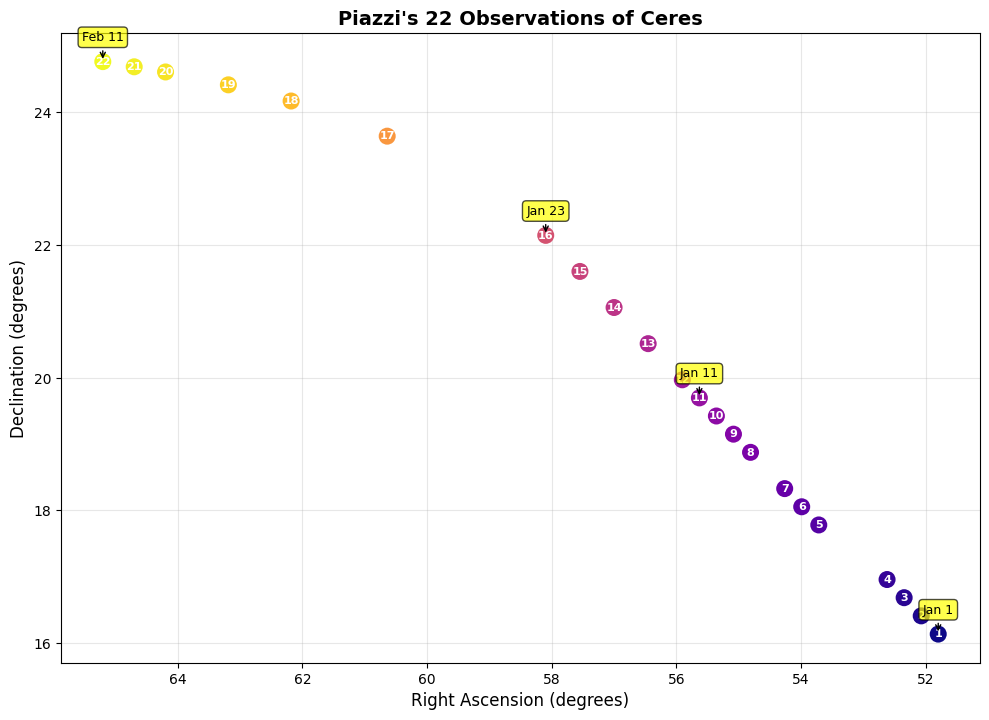
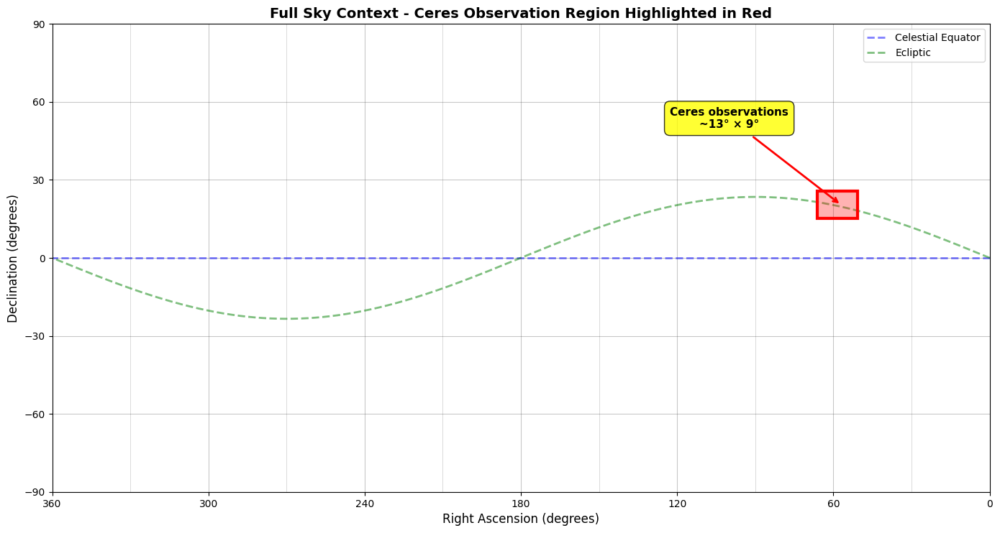

On January 1, 1801, the first asteroid, Ceres, was discovered, and just a month later, it was lost again behind the glare of the sun. Astronomers faced the challenge of calculating Ceres' orbit months into the future using only 22 observations. Being the first object of its kind to be discovered, astronomers did not know what eccentricity its orbit should have. Many tried guessing based on their "expertise," but Gauss solved the problem purely empirically - by analyzing data and making no further assumptions beyond Kepler's laws. 

Gauss ended up with the best estimate - the asteroid was rediscovered exactly where he predicted - and became the OG data scientist. In the process, he invented the method of maximum likelihood estimation, (not so) ordinary least squares, applied it to linear regression, and discovered his most enduring legacy - *the bell curve* (and some astronomy stuff). In this class, we will learn all of these things (not the astronomy stuff). 





The first figure above shows the trajectory of Ceres as seen by Piazzi, the astronomer who discovered it. The second figure shows the full sky and how small the region of the sky is that Piazzi was observing. Gauss had to make a prediction of where Ceres would be in the sky based on only 22 observations in this tiny region of the sky.


## The Estimation Problem

Formally we start with the so called estimation problem. We are given a set of data points: $$(x_i, y_i) \text{ for } i = 1, 2, \ldots, n.$$ 
Think of $x_i$ as inputs and $y_i$ as the corresponding outputs. 

In general, we can have multiple inputs and outputs i.e. $x_i$ and $y_i$ can be vectors. In the Ceres example, there is one input - the time of observation - and two outputs - the right ascension and declination of the asteroid (coordinates describing its position in the sky). For this class, for simplicity, we will assume that both $x_i$ and $y_i$ are real numbers. 

**Our goal is to estimate the output $y$ for a <u>new</u> input $x$.** In the Ceres example, we want to estimate the position of the asteroid at a future time.

### Regression

One method to solve the estimation problem is using regression. In regression analysis, we assume that there is some function $f$ such that

$$
y_i = f(x_i)
$$

Notice that there is no restriction on what $f$ can be. Data scientists have to make a choice of what $f$ should be based on their expertise and the data they have. Probability theoreticians and statisticians have developed a number of methods to make this choice in a principled way. In this class, we will learn about one such method - the method of least squares.

### A Motivating Example

Consider the following simple example. Suppose we have the following set of points

$$
(-1, 0), (0, 1), (1, 2), (2, 3)
$$

Our goal is to estimate the value of $y$ at $x = 3$. In this case there is a simple natural choice - we can fit the line $y = x + 1$ to the data points and use it to estimate the value of $y$ at $x = 3$. This gives us an estimate of $y = 4$.

```{python}
#| echo: false
import matplotlib.pyplot as plt
import numpy as np

x = [-1, 0, 1, 2]
y = [0, 1, 2, 3]

fig, ax = plt.subplots(figsize=(8, 5))

# Plot data points
ax.scatter(x, y, s=80, zorder=5)
for xi, yi in zip(x, y):
    ax.text(xi + 0.15, yi - 0.25, f"({xi}, {yi})", fontsize=9)

# Plot line y = x + 1
x_line = np.linspace(-2, 4, 100)
ax.plot(x_line, x_line + 1, color='blue', linewidth=1.5, linestyle='--', label='$y = x + 1$')

# Mark the prediction point
ax.axvline(x=3, linewidth=1, linestyle=':', color='gray')
ax.scatter([3], [4], marker='x', color='red', s=100, zorder=5)
ax.text(3 + 0.15, 4 + 0.15, "f(3) = 4", fontsize=10, color='red')

ax.axhline(y=0, color='k', linewidth=0.5)
ax.axvline(x=0, color='k', linewidth=0.5)
ax.set_xlabel('x')
ax.set_ylabel('y')
ax.set_xlim(-2, 4)
ax.set_ylim(-1, 5)
ax.legend()
ax.set_title('Linear fit to collinear data')
plt.tight_layout()
plt.show()
```

But now suppose the last data point was actually $(2, 3.5)$ instead of $(2, 3)$. The linear model $y = x + 1$ is no longer a perfect fit for the data. What should we do?

One option is to fit a cubic polynomial that passes through all four points exactly. The figure below shows both the original line (which no longer fits) and the cubic polynomial fit. The cubic gives us an estimate of $y = 6$ for $x = 3$.

```{python}
#| echo: false
x = [-1, 0, 1, 2]
y2 = [0, 1, 2, 3.5]

fig, ax = plt.subplots(figsize=(8, 5))

# Plot data points
ax.scatter(x, y2, s=80, zorder=5)
for xi, yi in zip(x, y2):
    ax.text(xi + 0.15, yi - 0.35, f"({xi}, {yi})", fontsize=9)

# Plot old line y = x + 1 (no longer fits)
x_line = np.linspace(-2, 4, 100)
ax.plot(x_line, x_line + 1, color='blue', linewidth=1, linestyle='--', alpha=0.5, label='$y = x + 1$ (old fit)')

# Plot cubic fit
a_0, a_1, a_2, a_3 = np.polyfit(x, y2, 3)
x_cubic = np.linspace(-2, 4, 100)
y_cubic = a_0 * x_cubic**3 + a_1 * x_cubic**2 + a_2 * x_cubic + a_3
ax.plot(x_cubic, y_cubic, color='green', linewidth=1.5, linestyle='-', label='Cubic fit')

# Mark the prediction point
ax.axvline(x=3, linewidth=1, linestyle=':', color='gray')
intersection_cubic = a_0 * 3**3 + a_1 * 3**2 + a_2 * 3 + a_3
ax.scatter([3], [intersection_cubic], marker='x', color='red', s=100, zorder=5)
ax.text(3 + 0.15, intersection_cubic + 0.15, f"f(3) = {intersection_cubic:.0f}", fontsize=10, color='red')

ax.axhline(y=0, color='k', linewidth=0.5)
ax.axvline(x=0, color='k', linewidth=0.5)
ax.set_xlabel('x')
ax.set_ylabel('y')
ax.set_xlim(-2, 4)
ax.set_ylim(-1, 7)
ax.legend()
ax.set_title('Cubic fit after perturbing last point')
plt.tight_layout()
plt.show()
```

Notice something troubling: a small change in one data point (from 3 to 3.5) caused a large change in our prediction (from 4 to 6). This is a hint that exact polynomial fits might not be the best approach. We'll see that **simpler models tend to be less sensitive to small changes in the data**, which makes them more robust when our measurements contain errors.


## Exact Polynomial Fits

Let's analyze the sensitivity problem more carefully. Given $n$ data points, we can always find a polynomial of degree $n-1$ that passes through all of them exactly.

### Sensitivity Analysis

::: {.callout-note}
## Exercises: Cubic Polynomial Fit

The following exercises analyze the sensitivity of cubic polynomial fits.

**Exercise 1:** Find the cubic polynomial $p(x) = a_0 + a_1 x + a_2 x^2 + a_3 x^3$ fitting the data $(-1, 0), (0, 1), (1, 2), (2, z)$. That is, find the coefficients $a_0, a_1, a_2, a_3$ (in terms of $z$) such that $p(-1) = 0$, $p(0) = 1$, $p(1) = 2$, and $p(2) = z$.

**Exercise 2:** Compute $p(3)$ (in terms of $z$).

**Exercise 3:** Compute $\dfrac{dp(3)}{dz}$. Call this $\kappa_{2 \to 3}$ (kappa).

:::

The constant $\kappa_{2 \to 3}$ represents the **sensitivity** of the estimate at $x=3$ to the value of the data point at $x=2$. One can similarly calculate the sensitivity $\kappa_{x_i \to 3}$ for each data point. These constants tell us how much the estimate at $x=3$ will change if we change the value of one of the data points. 

In practice, our data is often noisy and we do not know the true values. Any error in the data points will be amplified by the sensitivity constants. The larger the sensitivity, the more our estimate is affected by errors in the data. On the other hand, too small a sensitivity means that our estimate might neglect important information. So we want to find a model that balances these two competing goals.


### Lagrange Interpolation

We can extend the above analysis to polynomial fits of any degree. Consider data points $(i, y_i)$ for $i = 1, 2, \dots, n$, and suppose our goal is to estimate $y$ at $x = n+1$.

We can fit a degree $n-1$ polynomial, i.e., find coefficients $a_0, a_1, \dots, a_{n-1}$ such that 

$$
y_i = a_0 + a_1 \cdot i + a_2 \cdot i^2 + \dots + a_{n-1} \cdot i^{n-1}
$$

for all $i = 1, 2, \dots, n$. We call $a_i$ the **parameters** of our model. We will sometimes denote the estimates by $\widehat{a}_i$ to emphasize that they are computed from data.

The cleanest way to construct this polynomial is through Lagrange interpolation.

::: {.callout-note}
## Exercises: Lagrange Interpolation

**Exercise 4:** Suppose you fit a degree $n-1$ polynomial to the data points $(1, y_1), (2, y_2), \dots, (n, y_n)$. Call this polynomial $p(x)$. 

Imagine slightly tweaking the value of $y_1$ (the first data point) versus slightly tweaking $y_n$ (the last data point). Which tweak do you think would affect the estimate $p(n+1)$ more? 

Now consider the two extreme sensitivities $\kappa_{1 \to {n+1}} = \dfrac{dp(n+1)}{dy_1}$ and $\kappa_{n \to {n+1}} = \dfrac{dp(n+1)}{dy_n}$. Based on your intuition, which one do you think is larger?

**Exercise 5:** Let $j$ be an integer between $1$ and $n$. Find the degree $n-1$ polynomial $p_j(x)$ satisfying 

$$ 
p_j(i) = \begin{cases}
1 & \text{if } i = j, \\
0 & \text{if } i \neq j.
\end{cases}
$$

Such a polynomial is called a **Lagrange basis polynomial**.

The plots below show the four Lagrange basis polynomials for $n = 4$. Each polynomial equals 1 at exactly one node (green) and 0 at the others (red).

```{python}
#| echo: false
import matplotlib.pyplot as plt
import numpy as np

fig, axes = plt.subplots(2, 2, figsize=(10, 6))

x_points = [1, 2, 3, 4]

def lagrange_basis(x, j, nodes):
    result = np.ones_like(x, dtype=float)
    for k, node in enumerate(nodes):
        if k != j:
            result *= (x - node) / (nodes[j] - node)
    return result

for j, ax in enumerate(axes.flatten()):
    x_dense = np.linspace(0, 5, 200)
    y_dense = lagrange_basis(x_dense, j, x_points)
    
    ax.plot(x_dense, y_dense, 'b-', linewidth=2)
    ax.axhline(y=0, color='k', linewidth=0.5)
    ax.axhline(y=1, color='k', linewidth=0.5, linestyle=':')
    
    for k, xp in enumerate(x_points):
        if k == j:
            ax.scatter([xp], [1], color='green', s=100, zorder=5)
        else:
            ax.scatter([xp], [0], color='red', s=100, zorder=5)
    
    ax.set_xlim(0, 5)
    ax.set_ylim(-1.5, 2)
    ax.set_xlabel('x')
    ax.set_title(f'$p_{j+1}(x)$')
    ax.set_xticks(x_points)

plt.tight_layout()
plt.show()
```

**Exercise 6:** Use the Lagrange basis polynomials to find the degree $n-1$ polynomial $p(x)$ satisfying 

$$
p(i) = y_i, \text{ for } i = 1, 2, \dots, n.
$$


**Exercise 7:** Now calculate the two extreme sensitivities $\kappa_{1 \to {n+1}} = \dfrac{dp(n+1)}{dy_1}$ and $\kappa_{n \to {n+1}} = \dfrac{dp(n+1)}{dy_n}$. Does your answer match your intuition from Exercise 4?

:::

### Overfitting

You should find that the sensitivity of the estimate at $x = n+1$ to nearby data points increases with $n$. This means that as we increase the degree of the polynomial, our estimate becomes more sensitive to errors in the data. 

In fact, our example is especially nice since the input coordinates are evenly spaced. In general, the sensitivity can be much worse when coordinates are uneven or when the target is far from the data. This is called **Runge's phenomenon**.

The fact that sensitivity increases with model complexity is an example of a general phenomenon called **overfitting**. Overfitting occurs when we fit a model that is too complex for the data—such a model captures noise rather than signal and will not generalize well to new inputs.


## Approximate Fits

This brings us to approximate fits. Instead of requiring the polynomial to pass through all data points exactly, we can find a polynomial that is "close" to the data in some sense. There are many ways to define "closeness." 

The figure below shows three approaches to fitting the perturbed data $(-1, 0), (0, 1), (1, 2), (2, 3.5)$:

```{python}
#| echo: false
import matplotlib.pyplot as plt
import numpy as np

x = [-1, 0, 1, 2]
y2 = [0, 1, 2, 3.5]

fig, ax = plt.subplots(figsize=(10, 6))

# Plot data points
ax.scatter(x, y2, s=80, zorder=5, color='black')
for xi, yi in zip(x, y2):
    ax.text(xi + 0.1, yi - 0.4, f"({xi}, {yi})", fontsize=9)

x_dense = np.linspace(-2, 4, 200)

# 1. Cubic fit (passes through all points)
a_0, a_1, a_2, a_3 = np.polyfit(x, y2, 3)
y_cubic = a_0 * x_dense**3 + a_1 * x_dense**2 + a_2 * x_dense + a_3
ax.plot(x_dense, y_cubic, color='green', linewidth=1.5, label='Cubic (exact fit)')
intersection_cubic = a_0 * 3**3 + a_1 * 3**2 + a_2 * 3 + a_3

# 2. Quadratic fit using only closest 3 points
b_0, b_1, b_2 = np.polyfit(x[1:4], y2[1:4], 2)
y_quad = b_0 * x_dense**2 + b_1 * x_dense + b_2
ax.plot(x_dense, y_quad, color='orange', linewidth=1.5, label='Quadratic (3 closest points)')
intersection_quad = b_0 * 3**2 + b_1 * 3 + b_2

# 3. Linear least squares fit using all points
c_0, c_1 = np.polyfit(x, y2, 1)
y_linear = c_0 * x_dense + c_1
ax.plot(x_dense, y_linear, color='purple', linewidth=1.5, label='Linear (least squares)')
intersection_linear = c_0 * 3 + c_1

# Mark prediction points
ax.axvline(x=3, linewidth=1, linestyle=':', color='gray')
ax.scatter([3], [intersection_cubic], marker='x', color='green', s=100, zorder=5)
ax.scatter([3], [intersection_quad], marker='x', color='orange', s=100, zorder=5)
ax.scatter([3], [intersection_linear], marker='x', color='purple', s=100, zorder=5)

ax.text(3.15, intersection_cubic + 0.2, f"{intersection_cubic:.1f}", fontsize=9, color='green')
ax.text(3.15, intersection_quad + 0.2, f"{intersection_quad:.1f}", fontsize=9, color='orange')
ax.text(3.15, intersection_linear - 0.5, f"{intersection_linear:.1f}", fontsize=9, color='purple')

ax.axhline(y=0, color='k', linewidth=0.5)
ax.axvline(x=0, color='k', linewidth=0.5)
ax.set_xlabel('x')
ax.set_ylabel('y')
ax.set_xlim(-2, 4)
ax.set_ylim(-1, 8)
ax.legend(loc='upper left')
ax.set_title('Three different fitting approaches')
plt.tight_layout()
plt.show()
```

1. **Cubic polynomial (green):** Passes through all four points exactly, gives estimate $f(3) = 6$.

2. **Quadratic polynomial (orange):** Uses only the three closest points $(0,1), (1,2), (2,3.5)$, gives estimate $f(3) = 5.5$.

3. **Linear least squares (purple):** Finds the "best" line through all four points (we'll define "best" precisely later), gives estimate $f(3) = 4.5$.

The table below summarizes how sensitive each estimate is to changes in the last data point (comparing to when the last point was $(2,3)$ and the estimate was $f(3)=4$):

| Model | Estimate at $x=3$ | Exact fit? | Sensitivity $\frac{\Delta f(3)}{\Delta y_4}$ |
|-------|------------------|------------|----------------------------------------------|
| Cubic | 6.0 | Yes | $\frac{6-4}{0.5} = 4$ |
| Quadratic | 5.5 | No | $\frac{5.5-4}{0.5} = 3$ |
| Linear | 4.5 | No | $\frac{4.5-4}{0.5} = 1$ |

As expected, simpler models have lower sensitivity. But how do we find the "best" line through points that aren't collinear? This requires a precise definition of "best," which is where probability theory enters the picture.


## Looking Ahead

There is no unique solution to the estimation problem—your estimate depends on the model you choose. In this class, we will focus on linear models and learn how to choose among them using probability theory and statistics. 

In the next lecture, we will introduce the **method of maximum likelihood estimation**, which gives a principled way to define "best fit." We'll see that under natural assumptions about measurement errors, maximum likelihood leads to the **method of least squares**—the same method Gauss used to find Ceres.


## Additional Exercises

::: {.callout-note}
## Optional Exercises: Connections to Linear Algebra

These exercises connect polynomial interpolation to linear algebra concepts.

**Exercise 8:** Reinterpret Exercises 5 and 6 in terms of linear algebra. What vector space are we working in? What linear algebraic concepts do the Lagrange polynomials correspond to? What are you doing in Exercise 6 in terms of linear algebra?

**Exercise 9:** Suppose you fit a degree $n-1$ polynomial to the data points $(1, y_1), (2, y_2), \dots, (n, y_n)$. Write down the system of linear equations for the coefficients. The matrix of this system is called a **Vandermonde matrix**. 

**Exercise 10:** (Challenge) Find the coefficients of the Lagrange basis polynomials in terms of the inverse of the Vandermonde matrix. Compare this to your solution of Exercise 5. Use this to find a formula for the inverse of a Vandermonde matrix.

:::